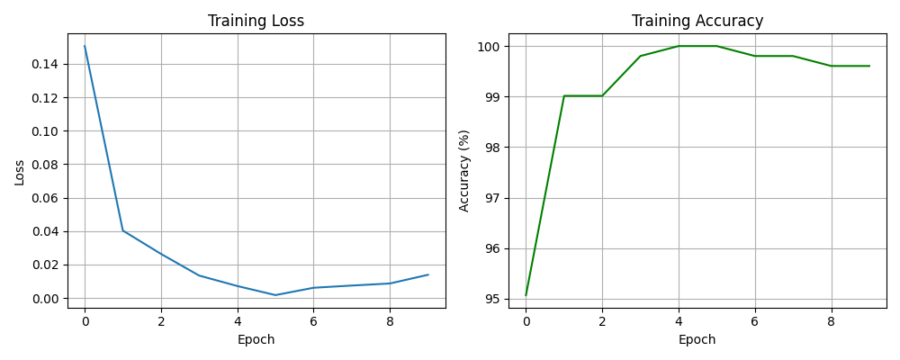
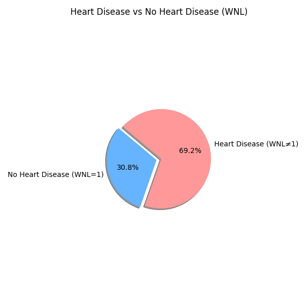

# 🫀 Heart Disease Prediction using Retinal Images

This project uses deep learning to predict the risk of heart disease by analyzing **retinal fundus images**.  
The goal is to develop a **non-invasive, AI-based system** that aids in early diagnosis of cardiovascular conditions using retinal biomarkers.

---

## 📌 Features

- Predicts **heart disease risk** from retinal fundus images  
- Uses **Convolutional Neural Networks (CNNs)** for image classification  
- Includes **image preprocessing, training, and prediction** pipeline  
- Provides an interactive **Streamlit interface** for predictions  

---

## 🛠️ Tech Stack

- **Language**: Python  
- **Libraries**: TensorFlow / Keras or PyTorch, OpenCV, NumPy, Pandas, Matplotlib  
- **Tools**: Streamlit, Jupyter Notebook / Google Colab / VSCode  

---

## 🗃️ Dataset

Use any of the following public or custom datasets:

- **MESSIDOR Dataset** – Retinal fundus images  
- **Kaggle Heart Disease Dataset** – For heart disease labels  
- **Custom Dataset** – Combining retinal images with cardiovascular risk scores  

> ⚠️ Ensure ethical handling and licensing compliance for medical data.

---
## View the Application:
```bash
https://projectheartdisease.streamlit.app/
```

## ⚙️ Installation

1. **Clone the repository**
   ```bash
   git clone https://github.com/yourusername/retinal-heart-disease-prediction.git
   cd retinal-heart-disease-prediction
   ```

2. **Install dependencies**

   ```bash
   pip install -r requirements.txt
   ```

3. **Run the Streamlit app**

   ```bash
   streamlit run app.py
   ```

---

## 🧪 Usage

### 1. Preprocess data

```bash
python preprocess.py
```

### 2. Train the model

```bash
python train.py
```

### 3. Predict using new images

```bash
python predict.py --image path_to_image.jpg
```

Or use the **Streamlit interface** to upload and predict directly.

---

## 📈 Sample Results

| Metric    | Value |
| --------- | ----- |
| Accuracy  | 87%   |
| Precision | 84%   |
| Recall    | 85%   |
| AUC-ROC   | 0.89  |

> Note: Results may vary depending on dataset size, preprocessing, and model configuration.

---

## 🖼️ Result Visualizations

### 🔹 Training Loss & Accuracy



### 🔹 Heart Disease Distribution



---

## 🚀 Future Scope

* Improve model accuracy with **transfer learning** (e.g., EfficientNet, ResNet)
* Develop **web or mobile-based screening interfaces**
* Integrate with **Electronic Health Records (EHR)** for clinical usage

---

## 🤝 Contributing

Contributions are welcome!
Fork the repository, make your changes, and submit a pull request.

---

## 👨‍💻 Author

**Name:** Dolitha Chowdary
**Email:** [dolithadasari1209@gmail.com](mailto:dolithadasari1209@gmail.com)

```

 

Would you like me to add clickable badges (for Python, TensorFlow, Streamlit, etc.) at the top to make it look even more professional?
```
